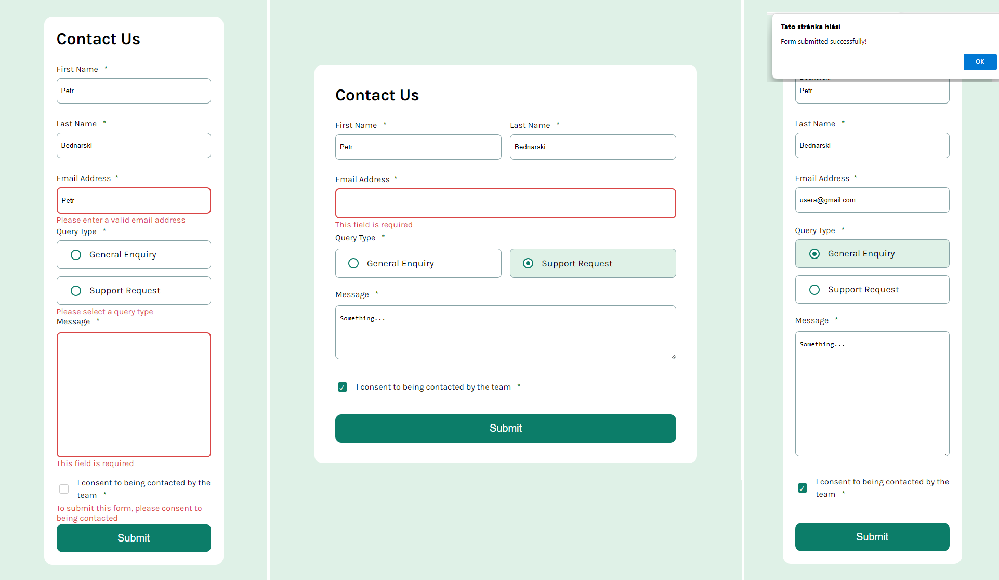

# Frontend Mentor - Contact form

## Welcome! 👋

My challenge was to build out a contact form and get it looking as close to the design as possible. I could use any tools I liked to help me complete the challenge. So if I had something I wanted to practice, I was free to give it a go.

I ensured that my users could:

- Complete the form and see a success toast message upon successful submission
- Receive form validation messages if:
- A required field has been missed
- The email address is not formatted correctly
- Complete the form only using their keyboard
- Have inputs, error messages, and the success message announced on their screen reader
- View the optimal layout for the interface depending on their device's screen size
- See hover and focus states for all interactive elements on the page

## Table of contents

- [Overview](#overview)
  - [The challenge](#the-challenge)
  - [Screenshot](#screenshot)
  - [Links](#links)
- [Author](#author)

## Overview

### The challenge

This challenge was a great opportunity for me to practice basic HTML and CSS tags. I recently updated my HTML and CSS files to apply CSS methodology (BEM).

### Screenshot

### Links

- Solution URL: [GITHUB SOURCE](https://github.com/pettik/FrontendMentor--contact-form)
- Live Site URL: [LIVE SITE 🌐](https://pettik-contact-form.netlify.app/)

## Author

- Website - [Petr Bednarski](https://github.com/pettik)
- Frontend Mentor - [@pettik](https://www.frontendmentor.io/profile/pettik)
